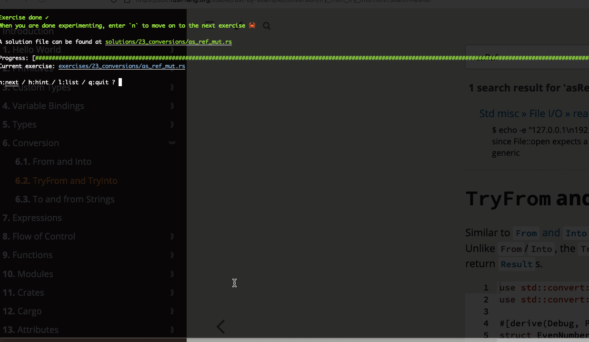

# Rustlings Exercises

This repository contains my completed Rustlings exercises, a set of small exercises designed to get familiar with the Rust programming language.



# Overview

Rustlings is a collection of exercises that cover a wide range of Rust concepts, including:

• Variables and Data Types
• Functions and Control Flow
• Error Handling
• Structs, Enums, and Traits
• Ownership and Borrowing
• Lifetimes
• Iterators and Closures

# How to Use

1. Clone this repository

```sh
git clone https://github.com/kulapoo/rustlings
```

2. Running the exercises

```sh
rustlings
```

3. Each exercise has its own file and tests that verify correctness. Solve the exercises by editing the .rs files.
